# abkit — experimentation platform & ranking-evaluation toolkit

[](https://github.com/D-L-Narayana/abkit/actions/workflows/ci.yml)
[](https://abkit.vercel.app)


[](LICENSE)

**[abkit.vercel.app](https://abkit.vercel.app)** — an experimentation platform in the browser: experiment dashboard, create-experiment wizard
with power analysis, results with confidence intervals, sequential p-value plots, sample-ratio-mismatch guardrails, CUPED before/after,
a ranking-metrics playground (NDCG / MRR / team-draft interleaving), CSV upload, shareable result links and methodology docs.

Underneath is a small, dependency-free **Python package** (`abkit/`) with the same statistics — z-test, Welch t, sample size, SRM, Holm,
CUPED, NDCG/MRR/interleaving — checked against SciPy in pytest, a CLI, and a Monte-Carlo simulation harness that quantifies why the
guardrails matter (peeking inflates false positives to 19.1%; CUPED with ρ = 0.6 removes 36% of variance and lifts power 70% → 88%).
The web app (`webapp/`, React 19 + Vite + TypeScript + Tailwind v4 + Recharts) mirrors those routines in TypeScript so everything runs
client-side — uploaded data never leaves the browser.

<p align="center">
  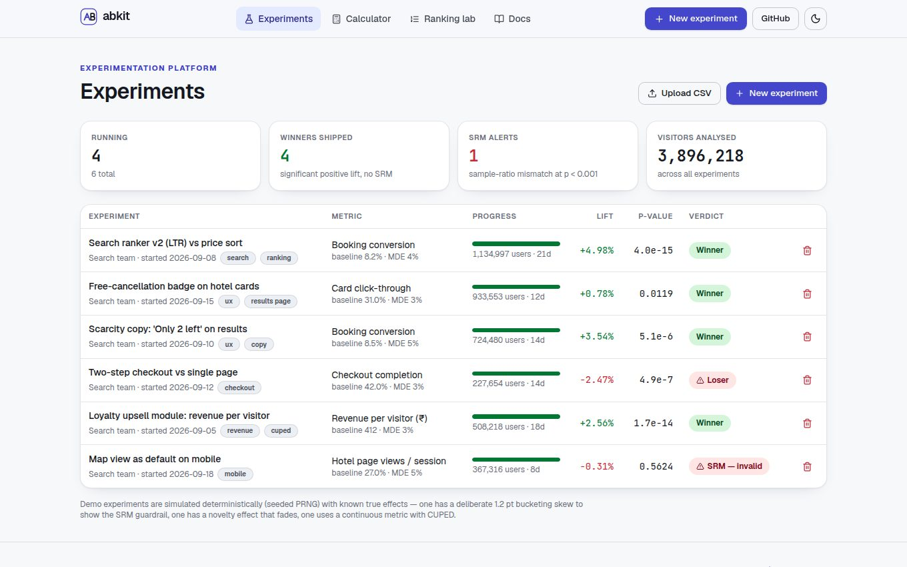
  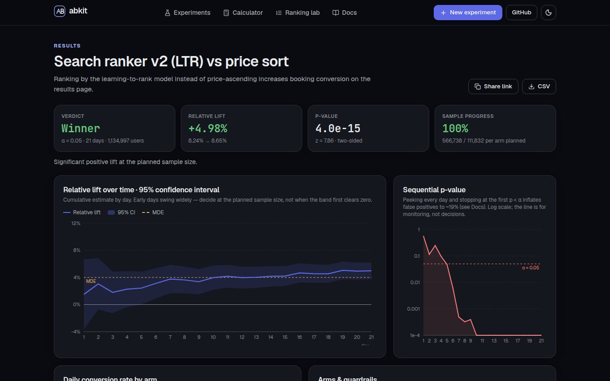
</p>
<p align="center">
  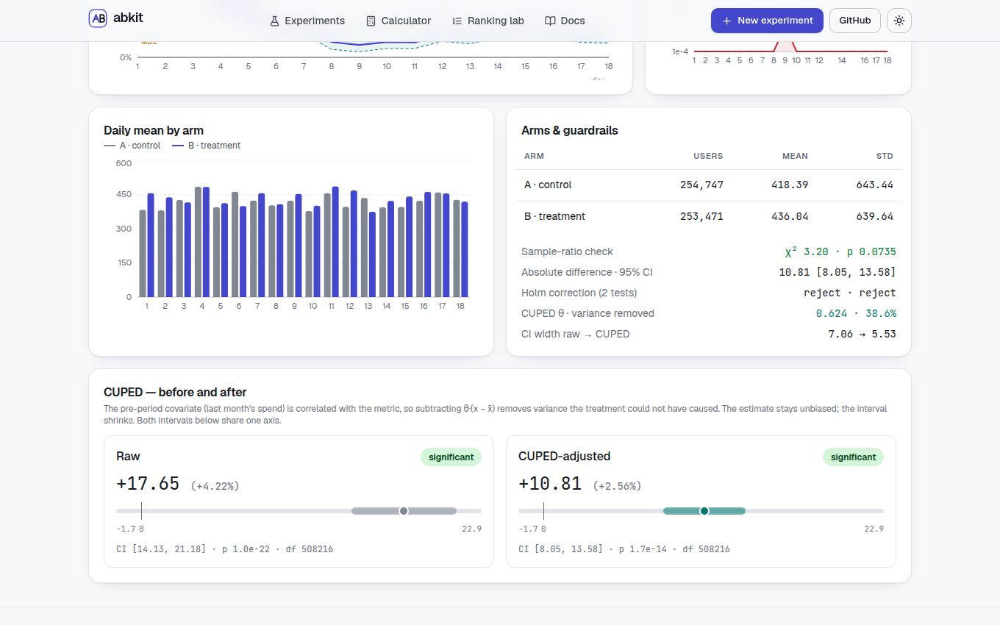
  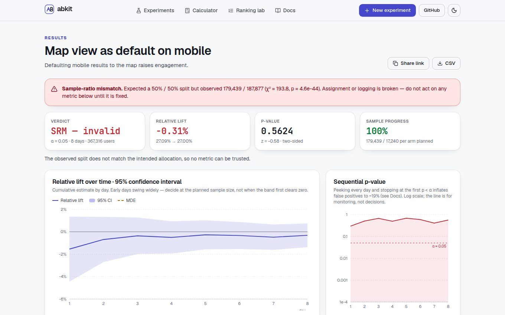
</p>
<p align="center">
  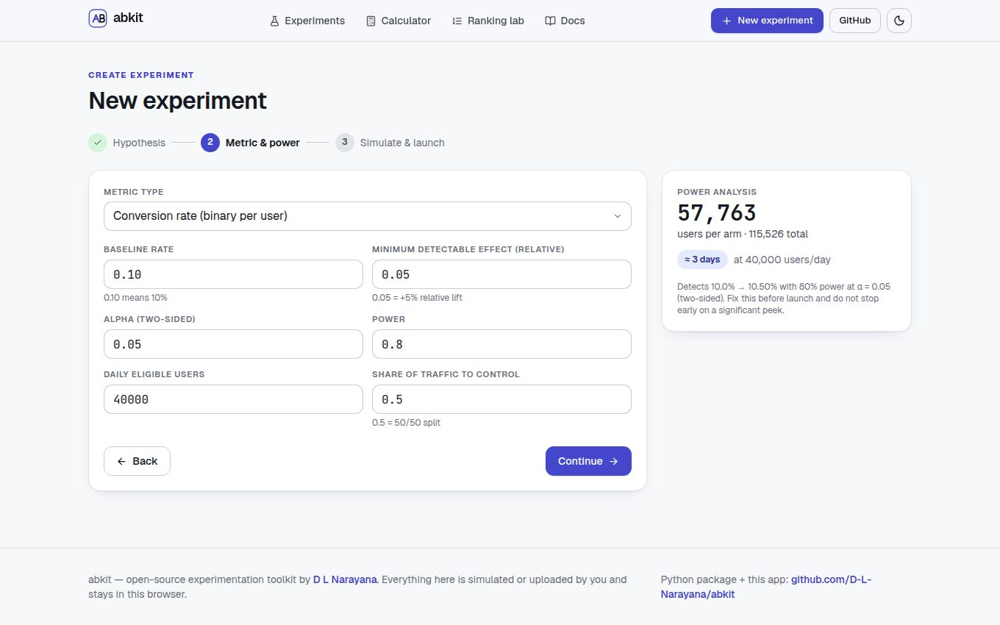
  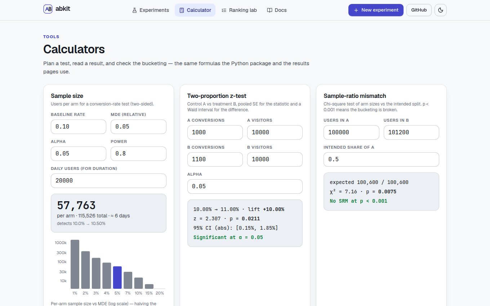
  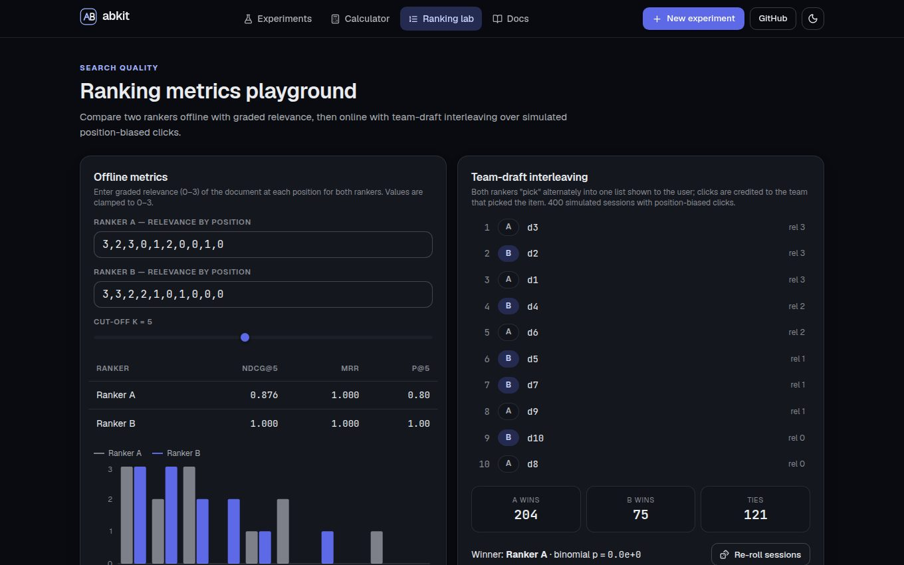
</p>
<p align="center">
  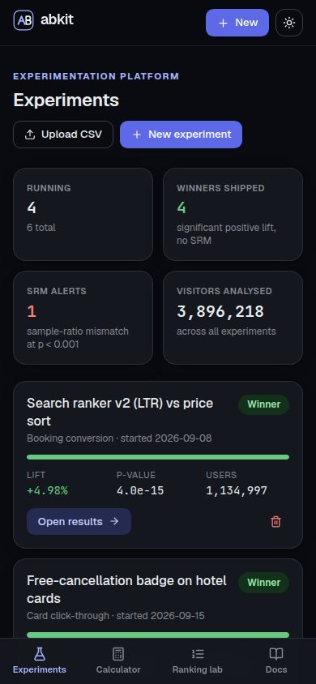
  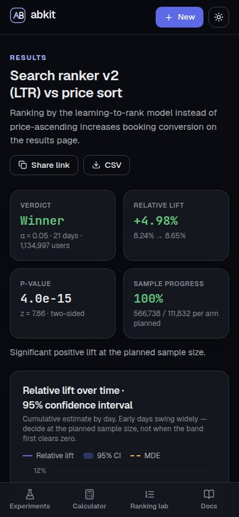
  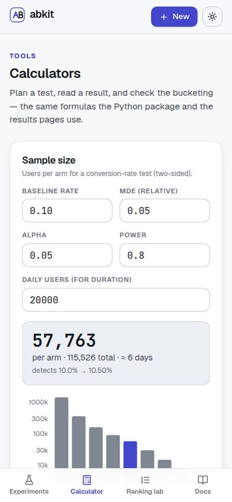
  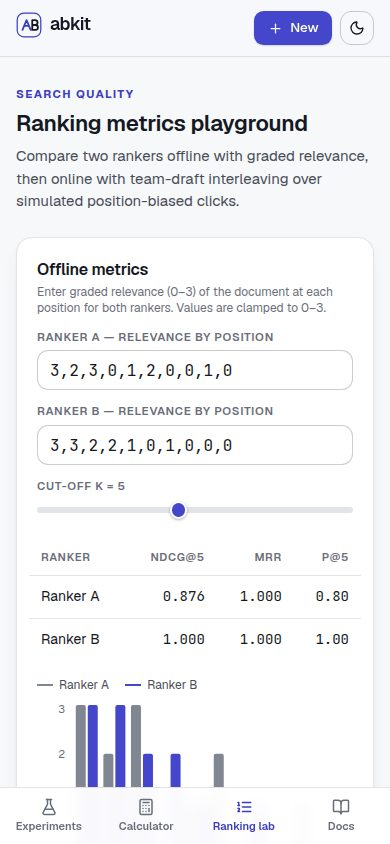
</p>

## The app

| Page | What you can do |
| --- | --- |
| **Experiments** `/` | Portfolio view: running / winners / SRM alerts / visitors; per-experiment progress to planned sample, lift, p-value and verdict chip |
| **New experiment** `/new` | 3-step wizard: hypothesis → metric type, baseline, MDE, α, power, traffic (live sample-size & duration) → simulate with a chosen true effect and launch |
| **Results** `/exp/:id` | Verdict, relative lift with CI, p-value, progress; lift-over-time with CI band and MDE line; sequential p-value plot; daily rates by arm; arms table; SRM χ², Holm correction; CSV export; **share link** (result encoded in the URL, read-only at `/share/…`) |
| **CUPED** (continuous metrics) | θ, variance removed, raw vs adjusted estimate, CI width before → after, dashed CUPED interval on the time-series |
| **Calculators** `/calculator` | Sample size with MDE curve (log scale), two-proportion z-test, sample-ratio-mismatch check |
| **Ranking lab** `/ranking` | Graded relevance for two rankers → NDCG@k, MRR, P@k; team-draft interleaving of both lists with 400 simulated position-biased sessions and a binomial win test |
| **Upload** `/upload` | Drag-and-drop CSV (`variant`, `converted` or `value`, optional `pre_value`, `day`) → full results page |
| **Docs** `/docs` | Formulas and guidance: z-test, power, peeking, SRM, CUPED, ranking evaluation, multiple comparisons |

Six demo experiments are simulated deterministically (seeded PRNG) with known true effects: a real winner, a loser, a null with a
deliberate 1.2-pt bucketing skew that trips the SRM guardrail, a novelty effect that fades, and a revenue metric with a correlated
pre-period covariate for CUPED. Deleting is undoable, and the demo set can be restored at any time.

**Design system.** One set of colour roles (`--bg/--card/--ink/--accent/…`) defined twice — light and dark — with separate shades for
*filled* controls and *text/links*, so buttons keep AA contrast in both themes. The theme follows `prefers-color-scheme` live until you
choose explicitly (persisted, synced across tabs, no flash on load); charts, tooltips and focus rings read the same variables. Every
component class sits in `@layer components`, so Tailwind utilities always win. Keyboard-accessible (skip-link, focus-visible rings,
labelled icon buttons, `aria-invalid` + inline errors on every numeric field), reduced-motion aware, responsive from 360 px — the
dashboard table becomes cards on phones.

```bash
cd webapp && npm ci && npm run dev      # http://localhost:5173
npm run build                           # typecheck + production bundle in webapp/dist (deployed to Vercel as a static SPA)
```

## What's inside

| Module | Functions | Notes |
| --- | --- | --- |
| `abkit.stats` | `two_proportion_ztest`, `welch_ttest` | pooled-SE z statistic + Wald CI; Welch–Satterthwaite df |
| | `sample_size_proportion`, `sample_size_mean` | classic power formulas (10 % baseline, +10 % rel, α 0.05, power 0.8 → **14,751 / arm**) |
| | `srm_check` | sample-ratio-mismatch chi-square guardrail at α = 0.001 |
| | `cuped` | CUPED variance reduction (Deng et al., 2013) with a shared θ so the lift stays unbiased |
| | `bonferroni`, `holm` | family-wise error control for multi-metric / multi-variant tests |
| `abkit.ranking` | `dcg`, `ndcg_at_k`, `mrr`, `precision_at_k` | offline ranking metrics |
| | `team_draft_interleave`, `interleaving_outcome` | team-draft interleaving (Radlinski, Kurup & Joachims, 2008) for online ranker comparison |
| `abkit.simulate` | six Monte-Carlo studies | writes `reports/simulation.json` |
| `abkit.cli` | `abkit ztest \| samplesize \| samplesize-mean \| srm \| simulate` | |
| `web/index.html` | z-test, sample size, SRM in vanilla JS | Acklam inverse-normal, regularised incomplete gamma for χ²; follows the OS light/dark scheme |

## Install & use

```bash
git clone https://github.com/D-L-Narayana/abkit.git && cd abkit
pip install -e ".[dev]"        # numpy, scipy, pytest
pytest -q                      # 9 tests

abkit ztest 1000 10000 1100 10000      # control: 1000/10000, treatment: 1100/10000
abkit samplesize 0.10 0.05             # visitors per arm for a +5 % relative lift on a 10 % baseline
abkit srm 100000 101200                # is a 100,000 / 101,200 split suspicious?  (yes: p ≈ 0.008 — borderline, watch it)
abkit simulate --quick                 # Monte-Carlo studies (full run: `abkit simulate`, ~10 min)
```

```python
from abkit import two_proportion_ztest, sample_size_proportion, cuped, ndcg_at_k

r = two_proportion_ztest(conv_a=1000, n_a=10_000, conv_b=1100, n_b=10_000)
r.lift_rel, r.p_value, (r.ci_low, r.ci_high)      # (0.10, 0.021, (0.0015, 0.0185))
sample_size_proportion(baseline=0.10, mde_rel=0.10)   # 14751
ndcg_at_k([3, 2, 0, 1], k=3)                          # 1.0 = ideal order
```

## Methodology, validated by simulation

`abkit simulate` (seed 2026) answers six questions an experimentation team argues about. Numbers from
[`reports/simulation.json`](reports/simulation.json):

| Question | Result | Reading |
| --- | --- | --- |
| **A/A tests** — does the z-test reject 5 % of the time when nothing changed? (20k sims, 20k users/arm) | **5.02 %** false positives | Calibrated to the nominal α. |
| **Power** — does `sample_size_proportion` deliver 80 % power at +10 % rel. lift on a 10 % baseline? | 14,751/arm → **80.3 %** power | The planning formula keeps its promise. |
| **Peeking** — look after each of 10 equal chunks, stop at the first p < 0.05 (A/A data) | **19.1 %** false positives; 2.6 % with α/looks per look | Optional stopping ~4× the error rate; per-look Bonferroni over-corrects — fix the sample size up front or use a sequential test. |
| **CUPED** — variance removed by a pre-period covariate with ρ = 0.6; is the lift still unbiased? | **36.0 %** less variance (theory ρ² = 36 %); power **70 % → 88 %**; bias 0.0003 | Free power from data you already have. |
| **SRM** — does the guardrail catch a 49/51 bucketing bug at 200k users? | **100 %** detected, 0.06 % false alarms (α = 0.001) | Cheap and reliable; run it on every experiment. |
| **Interleaving vs A/B** — sessions to identify the better of two rankers at p < 0.05 | median **1,173** (interleaving) vs **1,370** (A/B) | Interleaving decides faster because every user sees both rankers; the gain depends on the click model. |

All data is synthetic; the studies validate the *statistics*, not any product.

## Tests

`pytest -q` — z-test against a hand calculation, Welch against `scipy.stats.ttest_ind`, the 14.7k textbook sample size,
SRM on fair vs skewed splits, CUPED θ ≈ ρ and variance reduction ≈ ρ² with an unbiased lift, Holm/Bonferroni, NDCG/MRR/P@k
edge cases, and interleaving fairness (every item exactly once, teams balanced, coin-flip first pick).

## Layout

```
abkit/stats.py        tests, planning, guardrails, CUPED, corrections
abkit/ranking.py      NDCG, MRR, P@k, team-draft interleaving
abkit/simulate.py     Monte-Carlo studies -> reports/simulation.json
abkit/cli.py          command-line interface
tests/                pytest
webapp/src/
  stats.ts            TypeScript twin of the statistics (no dependencies)
  model.ts            experiment model, simulation, storage, share links, CSV
  lib/analysis.ts     cumulative analysis + verdicts shared by all pages
  theme.ts            light/dark with system-follow + persistence
  components/         layout, form fields, charts (theme-aware Recharts)
  pages/              Dashboard, Wizard, Results, Calculator, RankingLab, Upload, Docs
web/index.html        dependency-free static calculator (same formulas, one file)
```

## Roadmap

- Sequential testing (mSPRT / always-valid p-values) so peeking becomes legal
- Bootstrap CIs for ratio metrics (revenue per booking) and delta-method variance
- Stratified sampling and variance-reduced interleaving credit

## License

MIT © D L Narayana
