# abkit — experimentation platform & ranking-evaluation toolkit

[](https://github.com/D-L-Narayana/abkit/actions/workflows/ci.yml)
[](https://abkit.vercel.app)


[](LICENSE)

**[abkit.vercel.app](https://abkit.vercel.app)** — an experimentation platform in the browser: experiment dashboard with search, filters
and undoable lifecycle actions; a create-experiment wizard with live power analysis and scenario presets; results with delta-method
confidence intervals for the relative lift, **always-valid p-values (mSPRT) that make daily peeking legal**, sample-ratio-mismatch
guardrails and CUPED before/after; calculators for sample size, power at a given n and the smallest detectable effect; a ranking lab
whose interleaving verdict is an **exact binomial test**; CSV import of per-user or aggregated data with a preview; lossless CSV/JSON
exports, Markdown summaries and compressed share links; and methodology docs. Everything runs client-side — uploaded data never leaves
the browser, and the deployed site is served with a strict Content-Security-Policy (`script-src 'self'`, self-hosted fonts, no third-party origins).

Underneath is a small **Python package** (`abkit/`, NumPy + SciPy) with the same statistics — z-test and Welch t-test with delta-method
relative-lift intervals, power and sample size (both directions), SRM, Holm/Bonferroni, CUPED on raw values or sufficient statistics,
the mSPRT, NDCG/MRR/P@k, team-draft interleaving with the exact binomial test, and a CSV analyser — checked against SciPy and against
cross-language fixtures in pytest, a JSON-emitting CLI, and a Monte-Carlo harness that quantifies why the guardrails matter. The web app
(`webapp/`, React 19 + Vite + TypeScript strict + Tailwind v4 + Recharts) mirrors every routine in TypeScript and is tested against the
Python numbers.

<p align="center">
  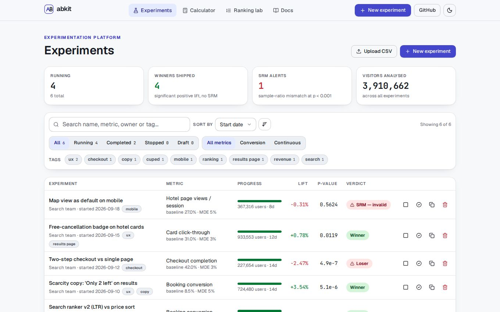
  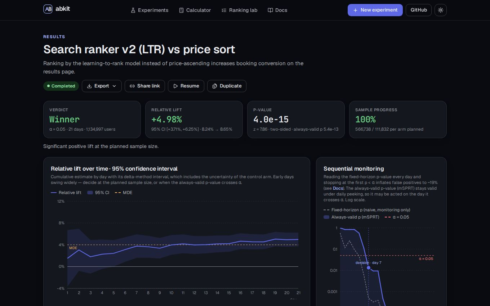
</p>
<p align="center">
  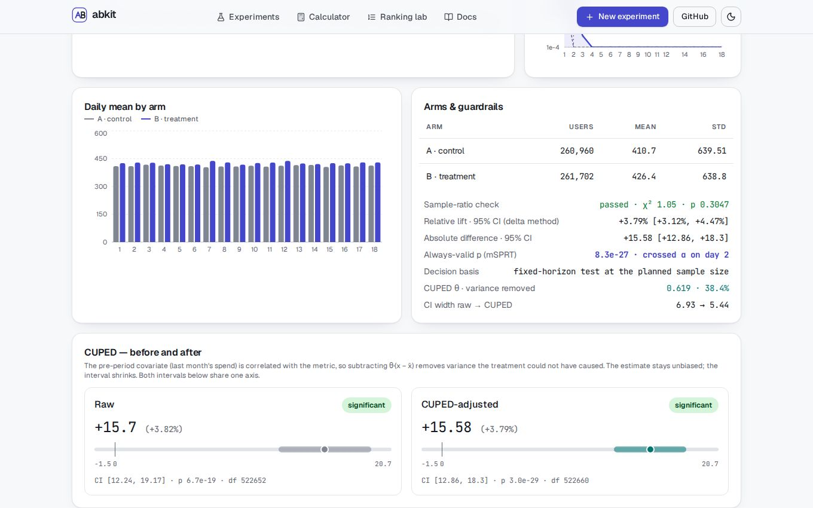
  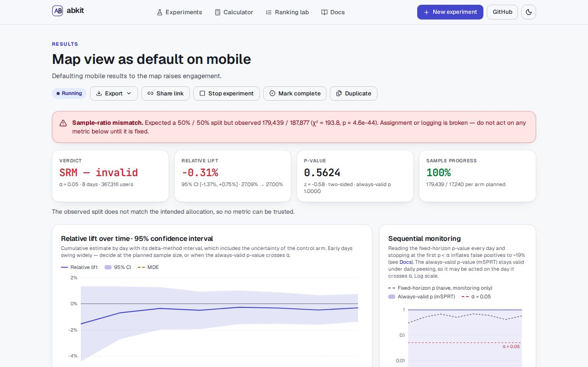
</p>
<p align="center">
  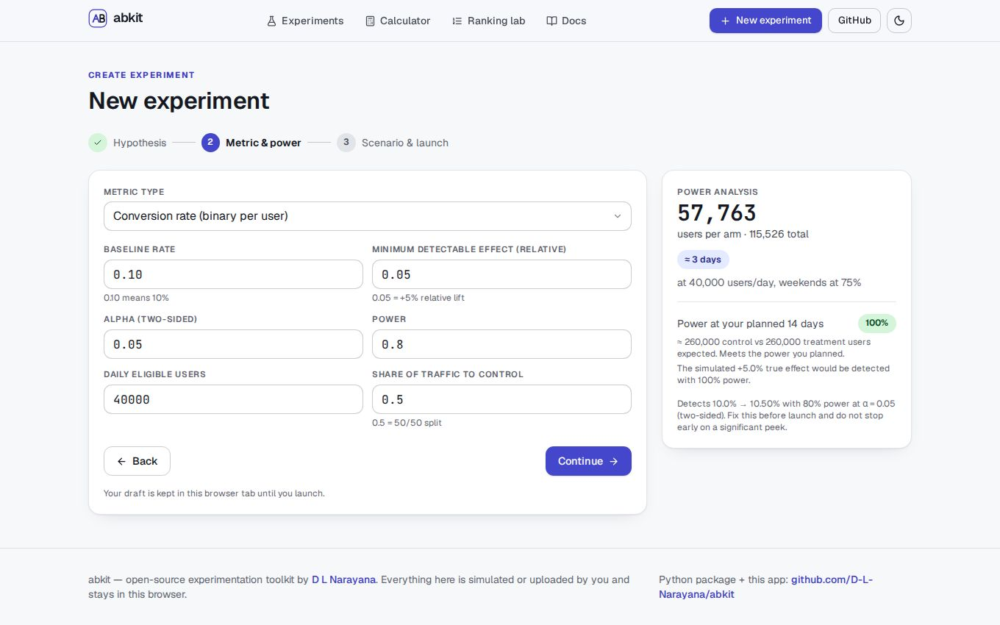
  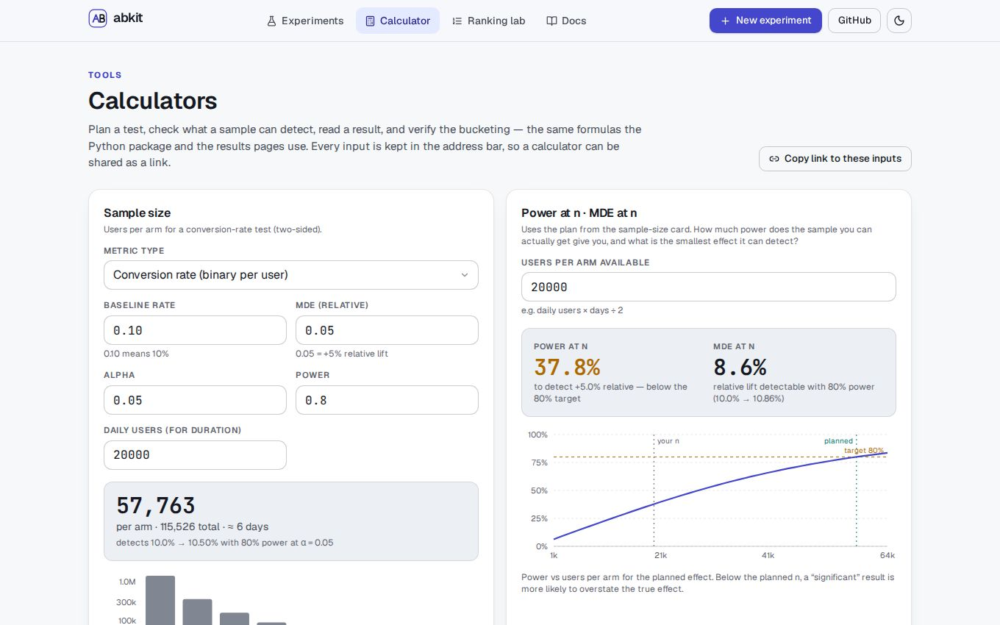
  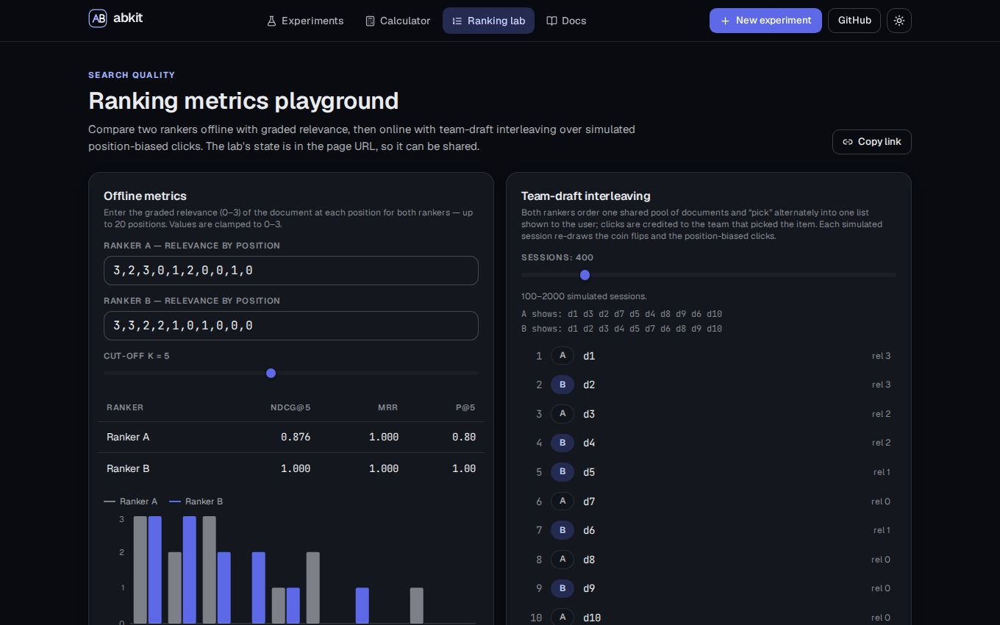
</p>
<p align="center">
  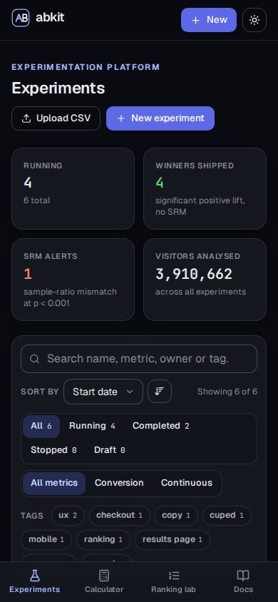
  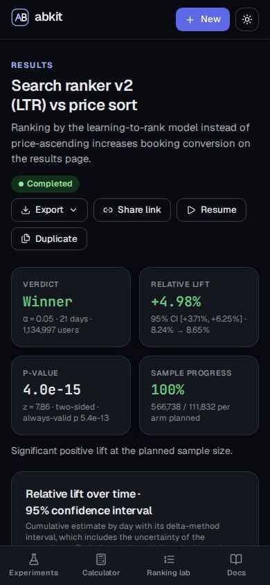
  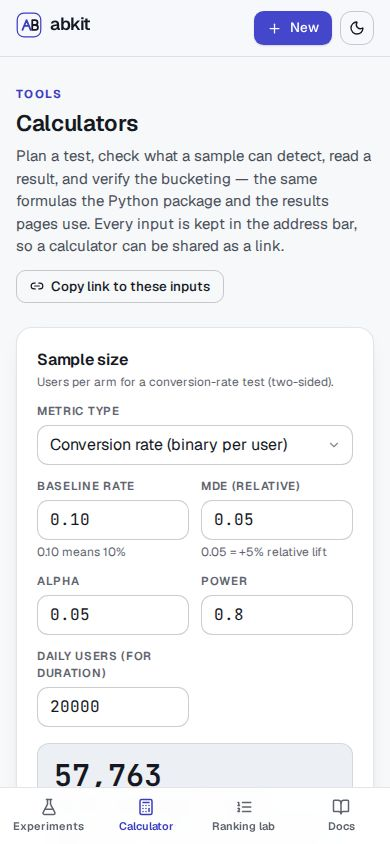
  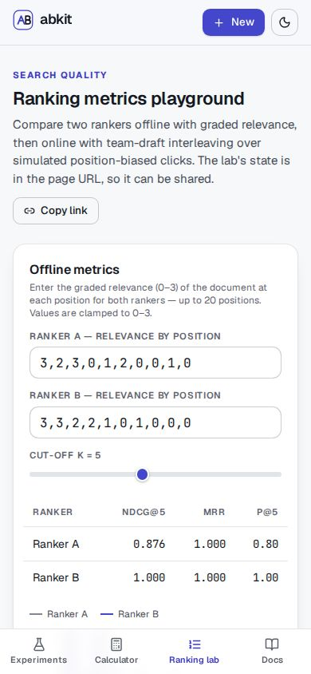
</p>

## The app

| Page | What you can do |
| --- | --- |
| **Experiments** `/` | Portfolio view: running / winners / SRM alerts / visitors; search by name, metric, owner or tag; status and metric-type filters, tag chips and sorting (all in the URL); per-experiment progress, lift, p-value and verdict chip; stop / resume / complete / duplicate / delete with undo; export all experiments as JSON and import them back; restore the demo set |
| **New experiment** `/new` | 3-step wizard: hypothesis & notes → metric type, baseline, MDE, α, power, traffic (live sample size, duration and **power at your planned number of days**) → a scenario preset (real effect, A/A, novelty decay, bucketing bug, revenue with CUPED, harmful change) or custom simulation settings. The draft survives a reload; `/new?from=<id>` prefills from an existing experiment |
| **Results** `/exp/:id` | Verdict with its decision basis; relative lift with a **delta-method CI** that includes the control arm's uncertainty; fixed-horizon p-value and the **always-valid p-value (mSPRT)** with the day it crossed α; lift-over-time with CI band and MDE line; sequential-monitoring plot (log scale); daily rates by arm; arms table; SRM χ²; CUPED before/after for continuous metrics; **exports** (lossless CSV, JSON, Markdown summary to the clipboard, print/PDF); **share link** (the whole result compressed into the URL, read-only at `/share/…`, saveable into your own list) |
| **Calculators** `/calculator` | Sample size for conversion and continuous metrics with the MDE curve; **power at a given n and the smallest detectable effect at n**; two-proportion z-test with absolute and delta-method relative CIs; sample-ratio-mismatch check — every input lives in the URL, so a calculation can be shared with a link |
| **Ranking lab** `/ranking` | Graded relevance for two rankers → NDCG@k, MRR, P@k; team-draft interleaving of one shared document pool over 100–2,000 simulated position-biased sessions with an **exact binomial test** on the decided sessions and a Wilson interval for the preference; state in the URL, re-rollable seed |
| **Upload** `/upload` | Drag-and-drop or paste CSV — one row per user (`variant`, `converted` or `value`, optional `pre_value`, `day`) or one row per arm and day (`users`, `conversions` or `sum`/`sum_sq`, optional CUPED sums); RFC-4180 quoting, `;`/tab delimiters, CRLF and BOM; preview of format, labels, days and users with every skipped row listed by line number, then a full results page |
| **Docs** `/docs` | Formulas and guidance grouped by topic: hypothesis tests, planning & power (incl. power at n and the delta method), guardrails & variance, sequential testing (mSPRT), ranking evaluation (exact interleaving test), data formats & sharing |

Six demo experiments are simulated deterministically (seeded PRNG) with known true effects: a real winner, a loser, a null with a
deliberate 1.2-pt bucketing skew that trips the SRM guardrail, a novelty effect that fades, and a revenue metric with a correlated
pre-period covariate for CUPED. The continuous demo draws its daily sufficient statistics from the exact sampling distribution of the mean
and covariance (Cholesky + Wishart/Bartlett), so its noise matches what the confidence intervals claim. Experiments live in a versioned
local-storage store; records that fail validation are quarantined (downloadable), never silently dropped.

**Design system.** One set of colour roles (`--bg/--card/--ink/--accent/…`) defined twice — light and dark — with separate shades for
*filled* controls and *text/links*, so buttons keep AA contrast in both themes. The theme follows `prefers-color-scheme` live until you
choose explicitly (persisted, synced across tabs, applied before first paint by a small external script so the strict CSP holds).
Fonts (Geist Variable, JetBrains Mono Variable) are bundled, not fetched from a CDN. Every component class sits in `@layer components`,
so Tailwind utilities always win. Keyboard-accessible (skip link, focus moves to the page content on navigation and the new page is
announced to screen readers, focus-visible rings, labelled icon buttons, numeric fields as plain text inputs with `aria-invalid` and
`aria-describedby` validation messages), reduced-motion aware, responsive from 360 px — the dashboard table becomes cards on phones.
A route-level error boundary turns a render error into a recoverable card instead of a blank app.

```bash
cd webapp && npm ci && npm run dev      # http://localhost:5173
npm run build                           # typecheck + production bundle in webapp/dist (deployed to Vercel as a static SPA)
npm test                                # vitest: statistics twin, analysis hub, storage, CSV/share, simulation honesty, …
npm run e2e                             # Playwright against the production bundle, served with the vercel.json headers (CSP enforced)
```

## Security headers & deployment

`vercel.json` (repository root) builds `webapp/` and serves `webapp/dist` as a static SPA with these response headers on every route:
`Content-Security-Policy: default-src 'self'; script-src 'self'; style-src 'self' 'unsafe-inline'; img-src 'self' data: blob:; font-src 'self';
connect-src 'self'; manifest-src 'self'; worker-src 'self' blob:; object-src 'none'; base-uri 'self'; form-action 'self'; frame-ancestors 'none'`,
`X-Content-Type-Options: nosniff`, `Referrer-Policy: strict-origin-when-cross-origin`, `X-Frame-Options: DENY`, a restrictive
`Permissions-Policy`, HSTS with preload and `Cross-Origin-Opener-Policy: same-origin`; compiled assets are cached as immutable. The browser
tests do not run against a bare dev server: `webapp/e2e/serve-dist.mjs` serves the built bundle with the headers and rewrites read from
that same `vercel.json`, every application-flow test records `securitypolicyviolation` events, console refusals, failed and foreign-origin
requests and fails if any occur, and `e2e/headers.spec.ts` asserts the exact header values on the shell, the compiled script, stylesheet
and font files. Only the axe-core accessibility audit runs in a separately named project with the policy bypassed, because axe injects
script content.

## What's inside

| Module | Functions | Notes |
| --- | --- | --- |
| `abkit.stats` | `two_proportion_ztest` (`alternative=` two-sided / larger / smaller), `welch_ttest`, `welch_ttest_from_stats` | pooled-SE z statistic + Wald CI; Welch–Satterthwaite df; from arrays or `MeanStats(n, mean, var)` |
| | `relative_lift_proportions`, `relative_lift_means`, `relative_lift_ci`, `ratio_metric_delta` | delta-method CI for the relative lift B/A − 1 (includes the control arm's sampling error); delta-method ratio metrics (e.g. revenue per booking) |
| | `sample_size_proportion`, `sample_size_mean`, `power_proportion`, `power_mean`, `mde_at_n` | classic power formulas in both directions (10 % baseline, +10 % rel, α 0.05, power 0.8 → **14,751 / arm**; `mde_at_n(0.10, 14751)` → 10 %) |
| | `srm_check` | sample-ratio-mismatch chi-square guardrail at α = 0.001 |
| | `cuped`, `cuped_from_sums` | CUPED variance reduction (Deng et al., 2013) with a shared θ so the lift stays unbiased; from raw values or `Sums` sufficient statistics (what the web app stores) |
| | `bonferroni`, `holm` | family-wise error control for multi-metric / multi-variant tests |
| `abkit.sequential` | `msprt_proportions`, `msprt_means`, `mixture_likelihood_ratio`, `always_valid_p`, `tau_from_mde` | mixture SPRT (normal mixing prior with scale τ): always-valid p-values that stay below α under any stopping rule (Ville's inequality) |
| `abkit.ranking` | `dcg`, `ndcg_at_k`, `mean_ndcg_at_k`, `mrr`, `precision_at_k` | offline ranking metrics |
| | `team_draft_interleave`, `interleaving_outcome`, `interleaving_test`, `wilson_interval`, `simulate_interleaving_sessions` | team-draft interleaving (Radlinski, Kurup & Joachims, 2008); exact two-sided binomial test on decided sessions with a Wilson interval for the preference 2p̂ − 1 |
| `abkit.data` | `read_csv`, `parse_csv_text`, `analyze` | the same CSV formats as the web app; `analyze` returns the full result (test, relative lift, SRM, CUPED, always-valid p series, verdict) as plain JSON-able data |
| `abkit.simulate` | eight Monte-Carlo studies | writes `reports/simulation.json`; `--quick` (10 %) and `--scale` for faster runs |
| `abkit.cli` | `abkit ztest \| ttest \| samplesize \| samplesize-mean \| power \| srm \| holm \| interleave \| ndcg \| analyze \| simulate` | JSON on stdout; invalid input → one line on stderr and exit code 2 |
| `web/index.html` | z-test (with the delta-method relative CI), sample size, SRM in vanilla JS | dependency-free single file; shows the eight simulation studies; follows the OS light/dark scheme |

## Install & use

```bash
git clone https://github.com/D-L-Narayana/abkit.git && cd abkit
pip install -e ".[dev]"        # numpy, scipy, pytest, pytest-cov, ruff, mypy
pytest -q

abkit ztest 1000 10000 1100 10000      # p = 0.0211; absolute CI [0.15 %, 1.85 %]; relative lift +10 % with delta-method CI [1.09 %, 18.91 %]
abkit ttest --mean-a 412 --sd-a 640 --n-a 15000 --mean-b 428.5 --sd-b 640 --n-b 15000
abkit samplesize 0.10 0.05             # visitors per arm for a +5 % relative lift on a 10 % baseline
abkit power --n 14751 0.10 --solve-mde # smallest relative effect detectable with 80 % power at 14,751 per arm → 0.09999927 (the planning formula, inverted)
abkit srm 100000 101200                # is a 100,000 / 101,200 split suspicious?  (χ² 7.16, p ≈ 0.0075 — borderline at α = 0.001, watch it)
abkit interleave 100 120 --ties 30     # exact binomial p = 0.2001, preference +9.1 % for B, 95 % CI [−4.1 %, +22.0 %] → no winner
abkit analyze tests/fixtures/csv/conversion_per_user.csv   # per-user or aggregated CSV → full analysis as JSON
abkit simulate --quick                 # Monte-Carlo studies at 10 % scale (full run: `abkit simulate`)
```

```python
from abkit import two_proportion_ztest, relative_lift_proportions, sample_size_proportion, msprt_proportions, interleaving_test

r = two_proportion_ztest(conv_a=1000, n_a=10_000, conv_b=1100, n_b=10_000)
r.lift_rel, r.p_value, (r.ci_low, r.ci_high)          # (0.10, 0.021, (0.0015, 0.0185))  — absolute CI
rel = relative_lift_proportions(1000, 10_000, 1100, 10_000)
(rel.ci_low, rel.ci_high)                              # (0.0109, 0.1891)                — relative CI, delta method
sample_size_proportion(baseline=0.10, mde_rel=0.10)   # 14751

# cumulative counts after each look; the always-valid p-value may be read every day
seq = msprt_proportions([50, 95, 160], [500, 1000, 1500], [60, 120, 190], [500, 1000, 1500], tau=0.01)
seq.always_valid_p, seq.decided_at                     # non-increasing p-values per look; first look below α (or None)

interleaving_test(wins_a=100, wins_b=120).p_value      # 0.2001 — exact binomial, not a z-test on complementary shares
```

## Methodology, validated by simulation

`abkit simulate` (seed 2026) answers eight questions an experimentation team argues about. Numbers from
[`reports/simulation.json`](reports/simulation.json), regenerated with this release:

| Question | Result | Reading |
| --- | --- | --- |
| **A/A tests** — does the z-test reject 5 % of the time when nothing changed? (20k sims, 20k users/arm) | **5.0 %** false positives | Calibrated to the nominal α. |
| **Power** — does `sample_size_proportion` deliver 80 % power at +10 % rel. lift on a 10 % baseline? | 14,751/arm → **80.3 %** power | The planning formula keeps its promise; `power_proportion` and `mde_at_n` invert it. |
| **Peeking** — look after each of 10 equal chunks, stop at the first p < 0.05 (A/A data, 4k sims) | **19.55 %** false positives; 2.75 % with α/looks per look | Optional stopping ~4× the error rate; per-look Bonferroni over-corrects. |
| **Legal peeking** — the same 10 looks, stopping on the mSPRT always-valid p-value (10k sims) | **1.04 %** false positives over 10 looks; at the planned size for the +10 % MDE it decides in **47.0 %** of runs (fixed-horizon test: 80.5 %), median decision at look 7 of 10, i.e. about 66.7 % of the planned sample | The always-valid p keeps the error rate under α however often you look; the price is power at the planned size — use it to stop early, read the fixed-horizon test when the planned sample is reached. |
| **CUPED** — variance removed by a pre-period covariate with ρ = 0.6; is the lift still unbiased? (2k sims) | **36.0 %** less variance (theory ρ² = 36 %); power **69.95 % → 88.1 %**; bias −0.0003 | Free power from data you already have. |
| **SRM** — does the guardrail catch a 49/51 bucketing bug at 200k users? (5k sims) | **100 %** detected, 0.10 % false alarms (α = 0.001) | Cheap and reliable; run it on every experiment. |
| **Interleaving vs A/B** — sessions to identify the better of two rankers at p < 0.05 (200 sims, capped at 3,000) | median **1,025** (interleaving) vs **1,587.5** (A/B) | Interleaving decides faster because every user sees both rankers; the gain depends on the click model. |
| **Relative-lift CI coverage** — does the 95 % interval cover the true relative lift? delta method vs the naive "absolute CI ÷ control rate" (10k sims each) | +10 % lift on a 10 % baseline: **95.1 %** delta vs 93.9 % naive; +50 % lift on a 5 % baseline: **94.9 %** vs 88.6 %; −10 % lift on a 20 % baseline: **94.9 %** vs 95.9 % | The naive interval ignores the control rate's own sampling error: too narrow for positive lifts, too wide for negative ones. |

All data is synthetic; the studies validate the *statistics*, not any product. The report was regenerated from the current code: the
first six studies consume the random stream exactly as in 1.0, but the previously committed report had been produced with different
settings for the interleaving study (300 runs capped at 4,000 sessions instead of the code's 200 / 3,000), so its peeking, SRM and
interleaving rows differed from what the code reproduces. `python scripts/sync_report.py --check` keeps `web/index.html` in step with the report.

## Tests

- **Python** (`pytest -q`, coverage enforced at ≥ 85 % in CI): `tests/test_stats.py` — z-test against hand calculations and SciPy, Welch
  against `scipy.stats.ttest_ind`, the 14.7k textbook sample size, power/MDE round trips, delta-method CI against a reference
  implementation plus a seeded coverage check, CUPED θ ≈ ρ and variance reduction ≈ ρ², `cuped_from_sums` as an exact twin of the array
  version, Holm/Bonferroni; `tests/test_sequential.py` — likelihood-ratio formula, monotone always-valid p, seeded A/A false-positive rate ≤ α
  under 20 looks and power at an effect equal to τ; `tests/test_ranking.py` — exact binomial p against `scipy.stats.binomtest` and an exact
  rational oracle, Wilson interval, NDCG/MRR/P@k, interleaving fairness; `tests/test_data.py` — both CSV layouts, RFC-4180 edge cases, label
  rules, skipped-row reporting and the parity fixtures; `tests/test_cli.py` and `tests/test_simulate.py` — every subcommand in-process, error
  exit codes, and a down-scaled run of all eight studies.
- **Cross-language fixtures** (`tests/fixtures/*.json`, `tests/fixtures/csv/`): generated by SciPy/Python and asserted by the TypeScript
  suites, so the browser shows the same numbers as the package (statistics to 1e-9 relative or tighter — the sequential and
  interleaving fixtures to 1e-12 — and p-values to 1e-8).
- **Web app** (`npm test`, vitest): `stats.test.ts` (erfc/normal/t/χ² against SciPy values, the delta-method family, power and MDE),
  `lib/analysis.test.ts` (verdict rules, always-valid series, never throws on malformed input), `lib/sequential.test.ts`,
  `lib/interleaving.test.ts`, `lib/csv.test.ts` and `lib/share.test.ts` (round trips, legacy links), `lib/storage.test.ts`
  (v1 → v2 migration with quarantine), `lib/summary.test.ts`, `model.test.ts` (the continuous demo's A/A rejection rate stays ≤ 10 %;
  the conversion demos are pinned bit-for-bit).
- **Browser** (`npm run e2e`, Playwright): the production bundle served with the real `vercel.json` headers and the CSP enforced, desktop
  and phone projects; header values, fonts, routes in both themes, dashboard filters and undo, wizard → results, calculator URL state,
  CSV upload of every fixture compared with the Python reference analysis, exports read back from the downloaded files, share links in a
  fresh browser context, storage migration, ranking-lab p-values against an independent oracle, theme persistence, focus management;
  plus an axe-core WCAG 2.2 AA audit of every route in both themes in its own clearly labelled project.
- **Distribution archives** (`python scripts/check_archive.py`, also in `scripts/check.sh` and CI): builds a fresh sdist and wheel with
  `setuptools.build_meta`, checks that the sdist carries every test module *and* every fixture under `tests/fixtures/` while the wheel
  carries only the package and its license, then runs the complete Python suite from the extracted sdist with coverage (≥ 85 %) —
  asserting afterwards that the `abkit` module the tests imported lives inside the extracted archive, never the checkout — and
  exercises the extracted wheel's CLI with the same assertion. `tests/test_packaging.py` keeps the same content checks in the regular
  test run.
- `sh scripts/check.sh` runs the whole gate locally (`--python-only`, `--no-e2e`); `.github/workflows/ci.yml` runs the same steps.

## Layout

```
abkit/stats.py        tests, planning (both directions), delta-method CIs, guardrails, CUPED, corrections
abkit/sequential.py   mixture SPRT: always-valid p-values
abkit/ranking.py      NDCG, MRR, P@k, team-draft interleaving, exact interleaving test
abkit/data.py         CSV import (per-user / aggregated) and full analysis → JSON
abkit/simulate.py     eight Monte-Carlo studies -> reports/simulation.json
abkit/cli.py          command-line interface (JSON output)
scripts/              check.sh (full local gate), sync_report.py (report → web/index.html)
tests/                pytest + cross-language fixtures (tests/fixtures)
webapp/src/
  stats.ts            TypeScript twin of the statistics (no dependencies)
  model.ts            experiment model, honest simulation, demo set
  lib/analysis.ts     cumulative analysis, always-valid series, verdicts shared by all pages
  lib/sequential.ts   mSPRT twin        lib/interleaving.ts  exact binomial / Wilson / lab simulator
  lib/csv.ts          CSV import/export, JSON export      lib/share.ts  compressed share links (v2) + legacy decoding
  lib/storage.ts      versioned local store with quarantine, React hooks      lib/summary.ts  Markdown summary
  lib/scenarios.ts    wizard presets    docs/  methodology sections by topic
  theme.ts            light/dark with system-follow + persistence
  components/         layout (focus management, announcer), form fields, charts, menu, error boundary
  pages/              Dashboard, Wizard, Results, Calculator, RankingLab, Upload, Docs
webapp/e2e/           Playwright specs, policy fixture, serve-dist.mjs (vercel.json headers for local runs)
web/index.html        dependency-free static calculator (same formulas, one file)
vercel.json           build settings, SPA rewrite and the production security headers
```

## Roadmap

- Bootstrap intervals for ratio metrics alongside the delta method
- Multi-variant (A/B/n) analysis with the corrections applied per family
- Stratified sampling and variance-reduced interleaving credit

## License

MIT © D L Narayana
